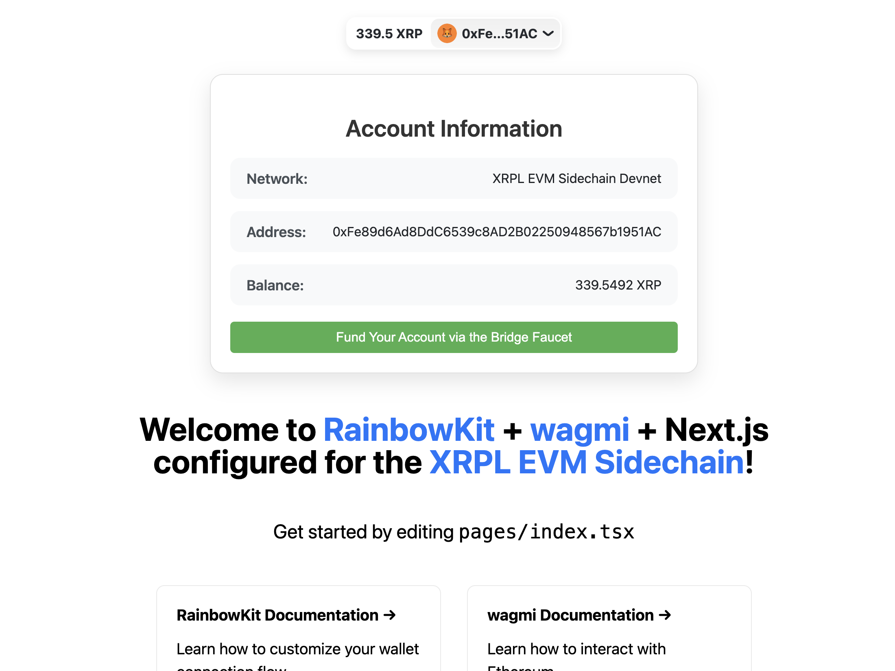

# XRPL EVM Sidechain RainbowKit Next.js (React) Template 🌈

This is a quickstart template for creating a Next.js application with RainbowKit wallet integration, pre-configured for the XRPL EVM Sidechain Devnet.

## Preview 



## Features

- Next.js for efficient React-based web development
- RainbowKit for seamless wallet connection
- Wagmi hooks for Ethereum interactions
- Pre-configured for XRPL EVM Sidechain Devnet
- Basic account information display (network, address, balance)
- Direct link to XRPL EVM Bridge Faucet

## Getting Started

1. Clone this repository
2. Install dependencies: `npm install` or `yarn install`
3. Run the development server: `npm run dev` or `yarn dev`
4. Open [http://localhost:3000](http://localhost:3000) in your browser

## Configuration

The template is pre-configured for the XRPL EVM Sidechain Devnet. You can modify the chain configuration in `src/pages/_app.tsx` and add more chains as needed. Visit the Rainbowkit documentation to learn how to configure your app.

```tsx
const xrpl_evm_sidechain_devnet = {
  id: 1440002,
  name: 'XRPL EVM Sidechain Devnet',
  iconUrl: 'https://s2.coinmarketcap.com/static/img/coins/64x64/52.png',
  iconBackground: '#fff',
  nativeCurrency: { name: 'XRP', symbol: 'XRP', decimals: 18 },
  rpcUrls: {
    default: { http: ['https://rpc-evm-sidechain.xrpl.org'] },
  },
  blockExplorers: {
    default: { name: 'xrpl-evm-explorer-devnet', url: 'https://evm-sidechain.xrpl.org' },
  }
} as const satisfies Chain;
```

## More XRPL EVM Sidechain Tutorials

| Repo                | Link                                                    |
|---------------------|---------------------------------------------------------|
| Deploy your first Solidity contract on the XRPL EVM Sidechain using Hardhat 👷 | [GitHub Repository](https://github.com/maximedgr/xrpl-evm-quickstart-hardhat) |
| Play with ZK on the XRPL EVM Sidechain ✨ | [GitHub Repository](https://github.com/maximedgr/zk-xrpl-evm-workshop) |


## Documentation

- [RainbowKit Documentation](https://www.rainbowkit.com/docs)
- [Wagmi Documentation](https://wagmi.sh/)
- [XRPL EVM Sidechain Documentation](https://www.xrplevm.org/)
- [Next.js Documentation](https://nextjs.org/docs)

### Additional Resources

|Resources|Link|
|---|---|
|Docs|https://www.xrplevm.org/|
|Bridge & Faucet|https://bridge.xrplevm.org/|
|MetaMask|https://metamask.io/|
|Solidity|https://docs.soliditylang.org/en/v0.8.26/|
|Hardhat|https://hardhat.org/|
|Remix IDE|https://remix.ethereum.org/|
|Grants|https://xrplgrants.org/|
|Accelerator|https://xrplaccelerator.org/|

## Contributing

Contributions are welcome! Please feel free to submit a Pull Request.

